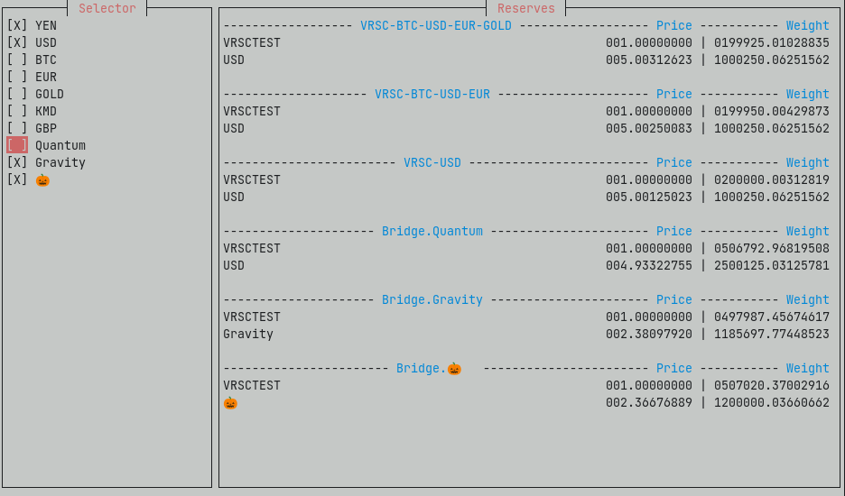

# Outpost

Watches reserves as they change per block.

You have the choice to watch all reserve currencies and their reserves, based on a selection of coins.

# Future versions

- add support for mempool scanning
- change PBaaS chains
- select specific currency baskets by their name

# DEV

Have 
Run with `RUST_LOG=info LC_ALL=en_US.UTF-8 cargo run --color always >> output.log 2>&1`

